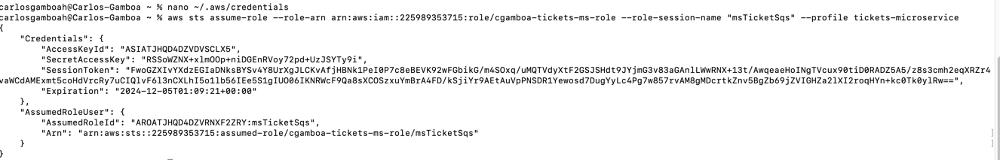

# ms-tickets-sqs
this service connects with aws sqs and publishes messages

## Generate temporal credentials for the role
In order to get authorization for accessing aws resources you must run the following command and pass
the resulting values to the env variables 
```
aws sts assume-role --role-arn arn:aws:iam::225989353715:role/cgamboa-tickets-ms-role --role-session-name "msTicketSqs" --profile tickets-microservice > assume-role-output.txt
```

### References
- https://docs.aws.amazon.com/sdk-for-java/latest/developer-guide/credentials-profiles.html
- https://docs.aws.amazon.com/IAM/latest/UserGuide/id_credentials_temp_use-resources.html

## Requirements
- java 17
- aws cli configured
- aws sdk 2x